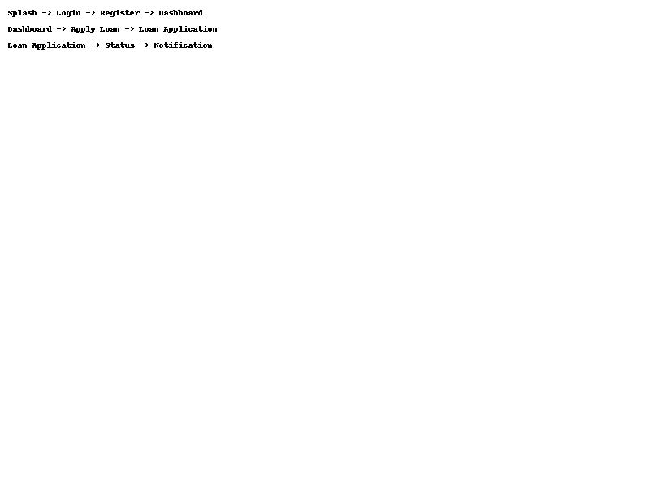
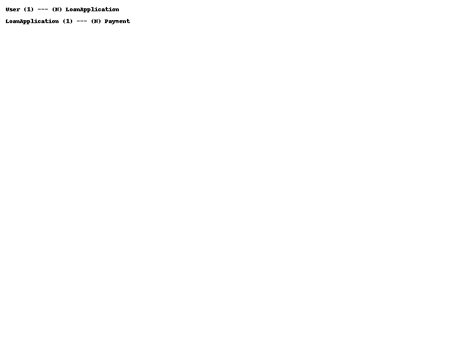

# 📱 PT XYZ - Loan Mobile App Design

> **Project Description**:  
Fintech app untuk layanan pinjaman online, dikembangkan oleh PT XYZ. Aplikasi ini memungkinkan pengguna untuk registrasi, meminjam uang, melihat status pinjaman, dan membayar tagihan dengan aman.

## 🚀 High Level Architecture

```
Client Layer (Mobile App)
  |
  v
API Gateway (Backend for Frontend / BFF Layer)
  |
  v
Application Services (Microservices Architecture)
  |
  v
Database Layer (PostgreSQL / MySQL + Object Storage)
  |
  v
Third Party Integrations (Email Gateway, SMS Gateway, Biometric Auth, Payment Gateway)
```

## 🖥️ Screen Flow Diagram



**Alur:**
- Splash Screen → Login Screen → (Biometric Option)
- Jika tidak login → Registration Screen
- Jika login berhasil → Dashboard
- Ajukan Pinjaman → Loan Application
- Cek Status Pinjaman → Loan Status
- Terima Notifikasi via Email/SMS

## 🗄️ ERD (Entity Relationship Diagram)



**Relasi:**
- User 1 -> N LoanApplication
- LoanApplication 1 -> N Payment

## 📡 API Specification

| Endpoint              | Method | Request Body                         | Response                   | Notes                          |
| :-------------------- | :----: | :----------------------------------- | :------------------------- | :----------------------------- |
| `/register`           | POST   | {name, email, phone, password, photo, ktp} | 201 Created             | Registrasi pengguna baru       |
| `/login`              | POST   | {email/phone, password}              | 200 OK (JWT Token)          | Login user                     |
| `/loan/apply`         | POST   | {amount, tenor_months}               | 200 OK (Application ID)     | Ajukan pinjaman baru           |
| `/loan/status`        | GET    | (JWT Token)                          | {status, approved_at}       | Cek status pinjaman            |
| `/payment/status`     | GET    | (JWT Token)                          | {outstanding_loan, monthly_payment} | Info sisa hutang & tagihan |
| `/notification/send`  | POST   | {user_id, type, message}             | 200 OK                      | Kirim notifikasi Email/SMS     |
| `/biometric/auth`     | POST   | {biometric_token}                    | 200 OK (JWT Token)          | Login menggunakan Biometric    |

## 📱 Screen Behavior

| Screen                 | Behavior |
|:-----------------------|:---------|
| **Splash Screen**       | Cek session/token validitas, redirect otomatis |
| **Login Screen**        | Input email/phone + password atau biometric |
| **Registration Screen** | Upload foto dan KTP, validasi input |
| **Dashboard Screen**    | Menampilkan hutang aktif dan tombol Apply Loan |
| **Loan Application Screen** | Validasi maksimal pinjaman Rp12 juta dan tenor 12 bulan |
| **Loan Status Screen**  | Menampilkan status pinjaman real-time |
| **Notification Screen** | Daftar notifikasi Email dan SMS |
| **Profile Screen**      | Update data pengguna, ganti password, logout |

## 🛠️ Teknologi Rekomendasi

- **Mobile**: Flutter / React Native
- **Backend API**: Node.js (NestJS) / Java (Spring Boot)
- **Database**: PostgreSQL
- **Authentication**: OAuth2 + JWT + Device Biometric Auth
- **Notification**: SendGrid API (Email) + Twilio API (SMS)
